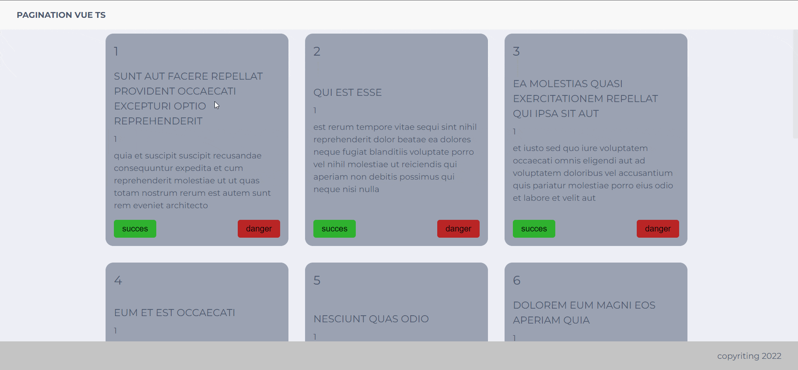

## PAGINATION VUE TYPESCRIPT
Реализована возможность подгрузки карточек на страницу ( пагинация )


<div align="left">



#
## Проект сожержит
<details>
  <summary >Vue</summary>

  [Что это?](https://vuejs.org/)

    Прогрессивный JavaScript-фреймворк

</details>

<details >
  <summary >TypeSctript for Vue</summary>
 
  [Что это?](https://vuex.vuejs.org/guide/typescript-support.html) 

    Vue предоставляет свои типы, поэтому вы можете использовать TypeScript для написания определения хранилища. Вам не нужна специальная конфигурация TypeScript для Vue. Пожалуйста, следуйте базовой настройке TypeScript Vue для настройки вашего проекта.
</details>

<details >
  <summary >VueX</summary>
 
  [Что это?](https://vuex.vuejs.org/) 
 
    Централизованное хранилище данных для всех компонентов приложения.
    Логика вынесена в отдельный модуль, входной точкой является файл store/index.js
</details>


<details>
  <summary>SCSS</summary>
 
  [Что это?](https://sass-scss.ru/)  

    Вы можете изменять  настройки в вашем проекте. 
    Для  автоматического комполирования файлов css необходимо запустить 

  Live Sass Compiler 

  [Что это?](https://marketplace.visualstudio.com/items?itemName=ritwickdey.live-sass)  

    В проекте scss создает  css файла  для разных цветовых тем.

</details>


<details>
  <summary>Локальный сервер</summary>
 
  [Что это?](https://ru.wikipedia.org/wiki/Localhost) 
 
  По умолчанию [localhost:8080](http://localhost:8080).
</details>


# 
## Для запуска потребуется
- этот репозиторий 
 ```
git clone https://github.com/VladislavBobyrev/cards-vue-ts
```
- node.js 
 
```
https://nodejs.org/en/
```

<!-- - Live Sass Compiler

 
```
https://marketplace.visualstudio.com/items?itemName=ritwickdey.live-sass
``` -->

- браузер

#
## Команды

|                        |                       |
|------------------------|:----------------------|
| Установить зависимости | `npm i`               |
| Запустить локально     | `npm run serve`       |
| Собрать                | `npm run build`       |
 
#
## Связвться со мной
<div align='center'> 
 
 ```
vladislavbobyrev@yandex.ru
```
 
 [](https://t.me/VladislavBobyrev)

 </div>
 
<div align="center">
  <h2>**ВНИМАНИЕ!**  Вся конфигурация является открытой. </h2>
 
**ВНИМАНИЕ!** На компьютере должны быть установлены программы `node` и `npm`.
Генерация  занимает много времени за счёт
установки `node_modules`. Необходимо дождаться окончания этого процесса.
 
</div>
